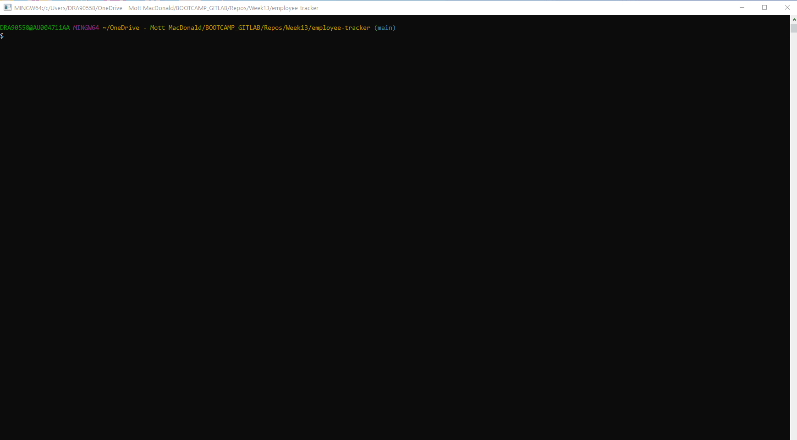
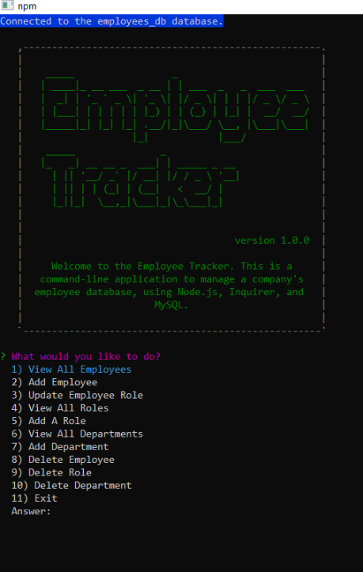
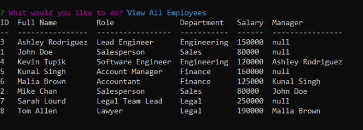
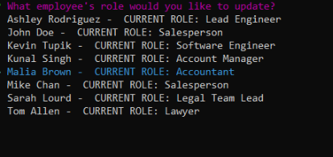

# Employee Tracker

[](https://opensource.org/licenses/MIT)


[](https://www.npmjs.com/package/inquirer)
[](https://www.npmjs.com/package/colors)
[](https://www.npmjs.com/package/console.table)


<details>
<summary><h2>Table of Contents</h2></summary>

- [Description](#description)
- [Installation](#installation)
- [Usage](#usage)
- [License](#license)
- [Contributing](#contributing)
- [Follow](#follow)
</details>

----

## Description

This is a command-line application to manage a company's employee database, using Node.js, [Inquirer package](https://www.npmjs.com/package/inquirer), and [MySQL] (https://dev.mysql.com/downloads/mysql/). A list of prompts allow users to update and manipulate the employee database.

The following animation shows the Employee Tracker appearance and functionality:



----

## Installation

💾    

- This application need node.js, please refer to [Offical website](https://nodejs.org/en/download/) for installation.
- This application also need to install mysql, please refer to [mysql](https://coding-boot-camp.github.io/full-stack/mysql/mysql-installation-guide/) for installation
- Add your mysql password to the  ```.env``` file
- Install required node packages by running the following at the root of your project

    ```bash
    npm install
    ```
    
- Create database and tables by running  ```schema.sql``` in the db folder
- Add sample data to the database by running  ```seeds.sql``` in the db folder

----

## Usage

💻   
  
Run the following command at the root of your project.

`node index.js` or `npm start`

🎥  A video of the typical user flow through the application can be found here [Employee Tracker](https://drive.google.com/file/d/1ganLHjwyPD1hb41hlS-3ATArDjgSH7so/view?usp=sharing) 

Also refer to the following screenshots

  





----

## License

This App is covered by the \


----

## Contributing

Fork this repository if you want to contribute\
[](https://github.com/MM-SalvoDragotta/team-profile-generator/fork)

----

## Follow
[](https://twitter.com/Dynamo_Sydney)\
[](https://github.com/MM-SalvoDragotta/)
